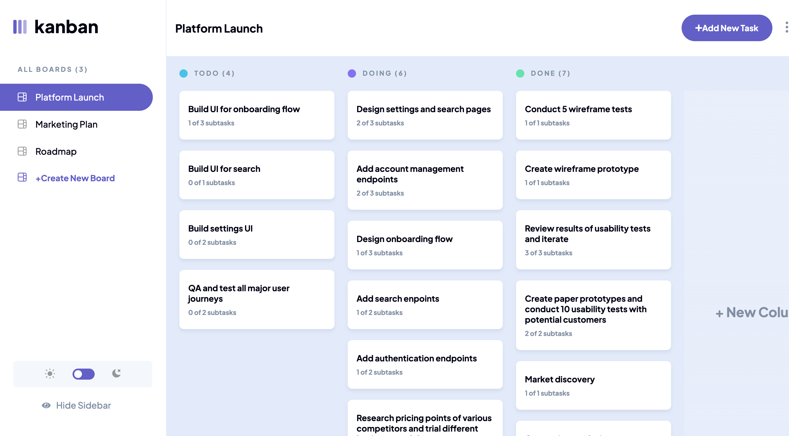
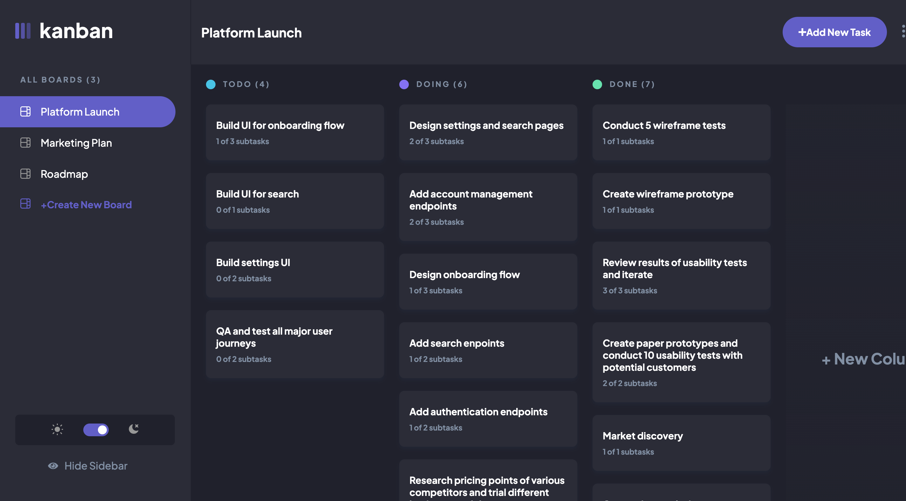
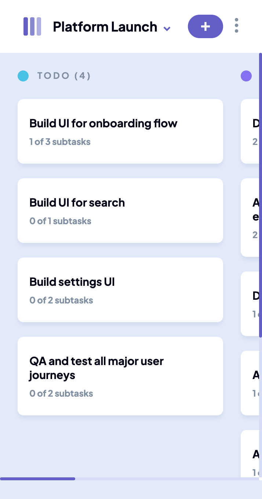

# Frontend Mentor - Kanban task management web app solution

This is a solution to the [Kanban task management web app challenge on Frontend Mentor](https://www.frontendmentor.io/challenges/kanban-task-management-web-app-wgQLt-HlbB). Frontend Mentor challenges help you improve your coding skills by building realistic projects.

## Table of contents

- [Setup](#setup)
- [Overview](#overview)
  - [The challenge](#the-challenge)
  - [Screenshot](#screenshot)
- [My process](#my-process)
  - [Built with](#built-with)
  - [What I learned](#what-i-learned)
  - [Continued development](#continued-development)
- [Author](#author)

## Setup

To run this project, install it locally using npm:

```
$ cd ../lorem
```

```
$ npm install
```

```
$ npm start
```

## Overview

### The challenge

Users should be able to:

- View the optimal layout for the app depending on their device's screen size
- See hover states for all interactive elements on the page
- Create, read, update, and delete boards and tasks
- Receive form validations when trying to create/edit boards and tasks
- Mark subtasks as complete and move tasks between columns
- Hide/show the board sidebar
- Toggle the theme between light/dark modes
- **Bonus**: Allow users to drag and drop tasks to change their status and re-order them in a column
- **note** : Unable to implement drag and drop id missing from JSON file , need to update data to be able to implement this feature -- _future Development_

### Screenshot

## kanban light theme



## kanban dark theme



## kanban mobile version layout



## My process

To ensure responsiveness on various devices, I initially organized the designs in the Figma files using a mobile-first strategy.

I then made the header and sidebar components, adding functionality to each to make sure it functioned as it should.

I then developed the main field, which would house the board and each board's tasks.

I developed Form UI components for adding, viewing, editing, and deleting tasks to simplify task management.

Once all the parts were in place, I modified the task functions to fit each layout and added functionality to them.

Finally, I extensively tested the project, making sure that each function was operational and evaluating it in various scenarios.

### Built with

- Semantic HTML5 markup
- CSS custom properties
- Flexbox
- CSS Grid
- Mobile-first workflow
- ReactContext-API
- [React](https://reactjs.org/) - JS library
- [Syntactically Awesome Style Sheets](https://sass-lang.com/) - For styles

### What I learned

This project helped me improve my skills in working with React-controlled forms, which were essential for updating, removing, and adding new data to JSON files.

The only problem i had to deal with is the deep nested objects and arrays , heres a snippet to update nested array in nested object , i dont know if this is best practice dealing with nested object , but it works 🤷

### Continued development

for this project :
-- add localStorage to save data
-- implement drag and drop

for next projects :
-- Framer Motion --> animation
-- tailwindCSS --> for styles
-- React Redux --> state management
-- Typescript instead of JS

## Author

- github - [bagggary](https://github.com/bagggary)
- Frontend Mentor - [ibrahim](https://www.frontendmentor.io/profile/ENG-SKYLER)
- Twitter - [heemo873](https://twitter.com/heemo873)
